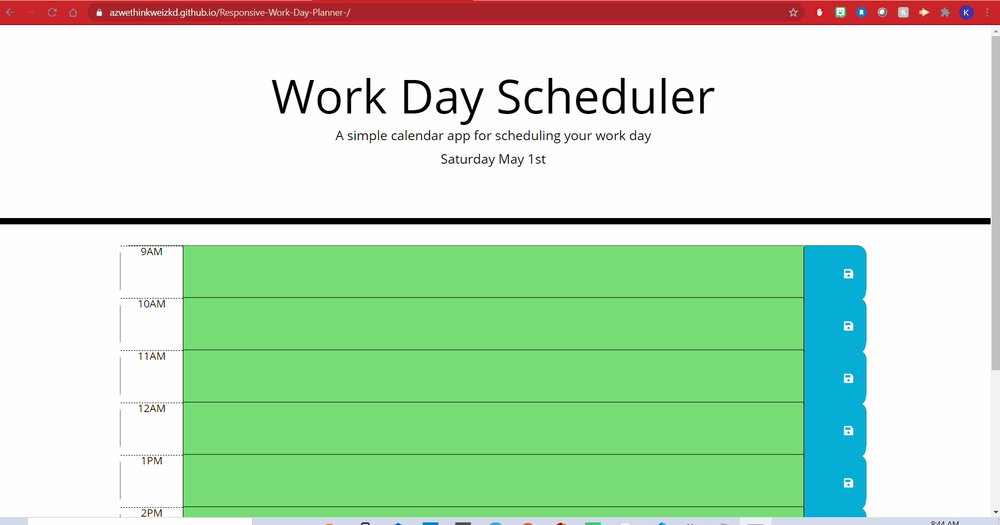

# Responsive-Work-Day-Planner-

This page will display a work day planner that will save events in and changes color based on time. Rows were made for each hour of the work day starting at 9AM and ending at 5PM. Each hour will dynamically change the color of the text form based off if the time is in the past (grey), present (red), or future (green). These colors will be diplayed through the use of moment js as well as the current day in the header. A save button was made to store each variable that is entered into the text box onto local storage, so if the page refreshes the information will stay persistant.

## Table of Contents

## Installation

No installation required for this program.

## Usage

Make sure to click save after each entry within the text area to store the information onto local storage. Not clicking the save icon will result in the information being lost after refresh of the page. Green text area means future, Red means present, Grey means past.

## Credits

## License
